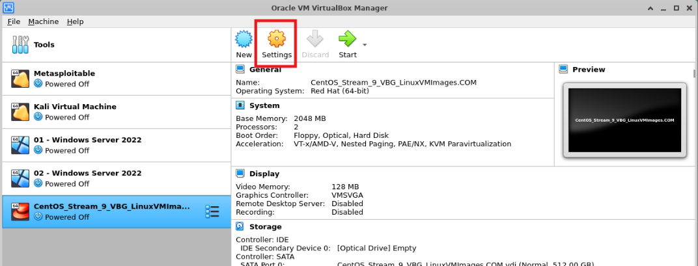
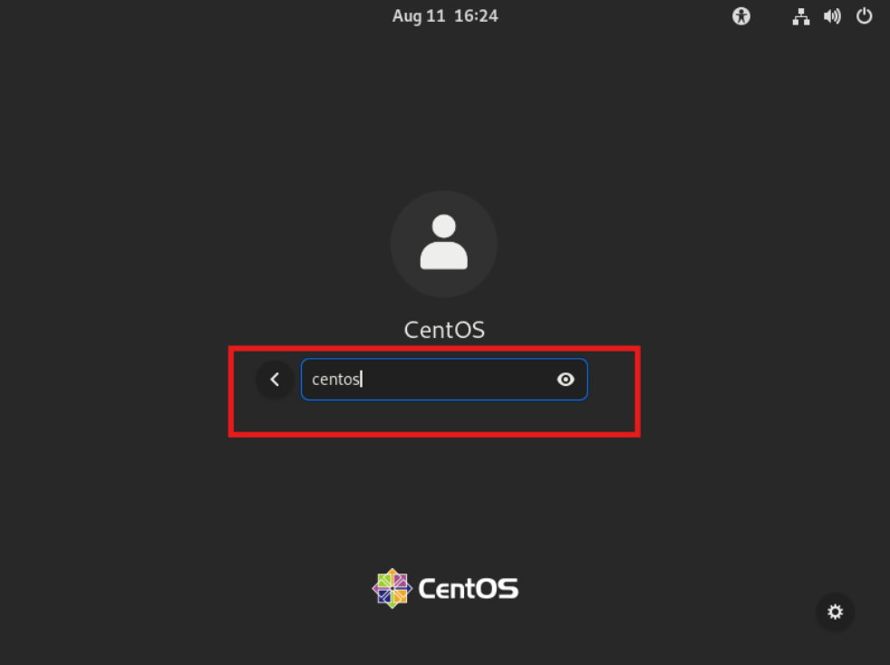

The project used the

`rockyou.txt`

 wordlist dThe project used the `rockyou.txt` wordlist during the lab.uring the lab.

# Linux Server Hardening, SSH Attack Monitoring & Automated IP Blocking

> A defensive cybersecurity lab focused on detecting SSH brute-force activity, monitoring authentication failures, hardening SSH, analyzing attack data, and automatically blocking suspicious IP addresses.


---

## 📌 Project Overview

This project demonstrates a defensive security workflow for protecting a Linux server against repeated SSH authentication attacks.

The lab environment was built using a CentOS Stream 9 virtual machine and a Kali Linux system to simulate failed SSH authentication attempts.

The project focuses on four major security objectives:

1. Deploy a Linux-based security lab and SSH attack-monitoring environment.
2. Monitor and analyze failed SSH authentication attempts.
3. Harden SSH configuration and change the default SSH port.
4. Automate suspicious IP identification and blocking using Bash scripts and `/etc/hosts.deny`.

The project also includes attack-data analysis using Linux authentication logs and supporting tools such as `whois`, `grep`, `awk`, and `sort`.

---

## 🎯 Objectives

The main objectives of this project were:

- Build a controlled Linux security lab.
- Configure an SSH-enabled CentOS server.
- Simulate failed SSH authentication attempts from Kali Linux.
- Monitor failed SSH authentication events.
- Extract attacker IP addresses from authentication logs.
- Generate daily and user-wise attack reports.
- Harden SSH configuration.
- Move SSH from the default port to a custom port.
- Configure SELinux for the custom SSH port.
- Automatically identify and block suspicious IP addresses.
- Maintain a backup of the IP-blocking configuration.
- Analyze attack patterns and generate security evidence.

---

# 🏗️ Lab Architecture

The project uses a virtualized environment consisting primarily of:

```text
                    ┌─────────────────────┐
                    │     Kali Linux      │
                    │                     │
                    │ Attack Simulation   │
                    │ SSH Authentication  │
                    └──────────┬──────────┘
                               │
                               │ SSH
                               │ Failed Attempts
                               ▼
                    ┌─────────────────────┐
                    │  CentOS Stream 9    │
                    │                     │
                    │  SSH Server         │
                    │  Apache HTTP        │
                    │  VSFTP              │
                    │  Security Logs      │
                    └──────────┬──────────┘
                               │
                               ▼
                    ┌─────────────────────┐
                    │ Security Scripts    │
                    │                     │
                    │ b_track_ssh_daily   │
                    │ b_track_ssh_userwise│
                    │ protect_ssh         │
                    └──────────┬──────────┘
                               │
                               ▼
                    ┌─────────────────────┐
                    │ /etc/hosts.deny     │
                    │                     │
                    │ Blocked IPs         │
                    └─────────────────────┘
```

Lab Environment
CentOS Stream 9
Kali Linux
Oracle VirtualBox
OpenSSH
SELinux
Bash



```text
sample/
```
```bash
ye code hai
```